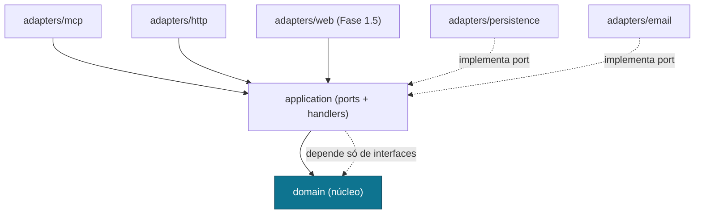
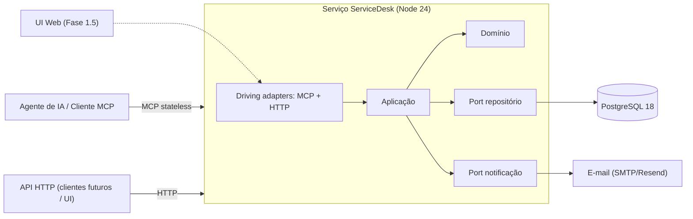
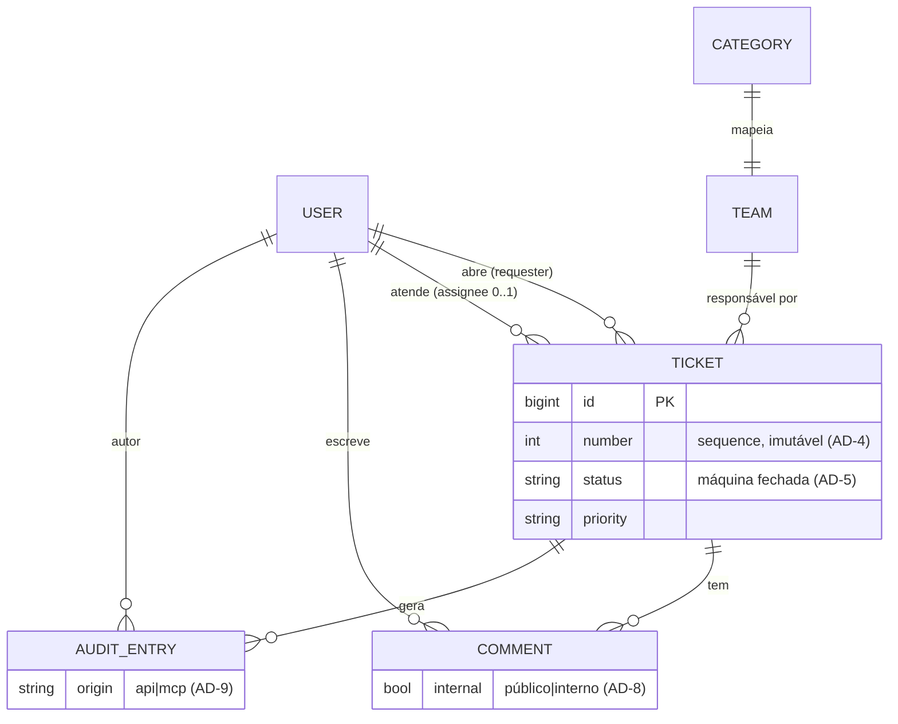

# Architecture Spine — ServiceDesk

## Design Paradigm

**Hexagonal (Ports & Adapters).** Um **núcleo de domínio** puro no centro, cercado por **ports** (interfaces) e **adapters** que traduzem o mundo externo. Os dois pontos de entrada — servidor **MCP** e **API HTTP** (e a UI web na Fase 1.5) — são *driving adapters* que batem no mesmo núcleo; persistência e e-mail são *driven adapters*. Isso torna o invariante do produto ("MCP e UI consomem a mesma camada de domínio") uma regra estrutural, não uma convenção.

Mapa paradigma → diretórios:

| Camada hexagonal | Diretório | Papel |
| --- | --- | --- |
| Domínio (núcleo) | `src/domain/` | Entidades, regras, máquina de estados, contratos Zod. Zero deps de fora. |
| Aplicação (ports/casos de uso) | `src/application/` | Command/query handlers; orquestra domínio + ports. |
| Driving adapters | `src/adapters/mcp/`, `src/adapters/http/`, (`src/adapters/web/` — Fase 1.5) | Traduzem entrada externa em chamadas de aplicação. |
| Driven adapters | `src/adapters/persistence/`, `src/adapters/email/` | Implementam ports de saída (repositório, notificação). |

## Invariants & Rules

### AD-1 — Dependências apontam só para dentro
- **Binds:** all
- **Prevents:** lógica de negócio vazar para o adapter MCP ou HTTP, fazendo os dois pontos de entrada divergirem.
- **Rule:** `domain` não importa de `application`/`adapters`/infra; `application` importa só de `domain`; adapters importam de `application`/`domain`, nunca o contrário. Dependências cruzam para dentro exclusivamente. `[ADOPTED]`

### AD-2 — O domínio é o único ponto de mutação de estado
- **Binds:** FR-1..FR-7, FR-13..FR-17
- **Prevents:** MCP e API implementarem regras divergentes ou dois caminhos de escrita paralelos.
- **Rule:** toda mudança de Chamado passa por um command handler de `application` que invoca o domínio; nenhum adapter acessa o repositório/DB diretamente para escrever. `[ADOPTED]`

### AD-3 — Auditoria é transacional, com autor e origem
- **Binds:** FR-22, todas as escritas
- **Prevents:** lacunas de auditoria; divergência entre a mudança e seu registro.
- **Rule:** cada command handler grava a mudança **e** o registro de Log de auditoria (autor + origem `api|mcp`) na **mesma transação**; nenhuma escrita escapa disso.

### AD-4 — Número é gerado e possuído pela persistência
- **Binds:** FR-1
- **Prevents:** dois componentes gerando IDs conflitantes; Número mutável.
- **Rule:** o Número vem de uma sequence do PostgreSQL, atribuído no insert do Chamado; nunca gerado em código de aplicação/adapter; imutável após criação.

### AD-5 — Status é uma máquina de estados fechada, validada no domínio
- **Binds:** FR-4, FR-7
- **Prevents:** o adapter MCP permitir uma transição que a API proíbe (ou vice-versa).
- **Rule:** as transições válidas entre valores de Status são definidas uma vez no domínio; ambos os adapters chamam a mesma função de transição. Transição inválida é rejeitada pelo domínio.

### AD-6 — Contratos MCP e API derivam de uma única fonte Zod
- **Binds:** FR-13..FR-16
- **Prevents:** o schema das Tools MCP divergir do contrato da API.
- **Rule:** as formas de request/response de cada caso de uso são definidas uma vez como schemas Zod em `application`; o adapter HTTP e o adapter MCP derivam validação e tipos desses mesmos schemas — nenhum redefine o shape.

### AD-7 — Ações irreversíveis exigem confirmação no domínio
- **Binds:** FR-7, FR-15, FR-17
- **Prevents:** o caminho MCP pular o human-in-the-loop que a UI aplica.
- **Rule:** os commands `fechar`/`cancelar`/`reabrir` só executam com um sinal de confirmação explícito no input; a exigência vive no domínio, não no adapter — todo ponto de entrada a herda.

### AD-8 — Autorização (papel + posse) é aplicada no domínio
- **Binds:** FR-2, FR-19, FR-20, FR-21
- **Prevents:** o MCP expor dados que a UI esconde (Solicitante ver Chamado alheio ou Comentário Interno).
- **Rule:** todo command/query recebe um principal autenticado; as regras de visibilidade (Solicitante vê só os próprios Chamados e apenas Comentários Públicos; Agente vê todos) vivem em `application`/`domain`, não em cada adapter.

### AD-9 — Identidade e origem propagam até a auditoria
- **Binds:** FR-21, FR-22
- **Prevents:** autoria ambígua ("humano via IA" vs. agente autônomo).
- **Rule:** cada adapter autentica um principal (identidade) e carimba a origem (`api|mcp`); a **identidade do token** — nunca o nome da tool — é o autor gravado no Log de auditoria.

### AD-10 — Concorrência otimista aplicada no command handler
- **Binds:** FR-7 (edição concorrente), FR-3..FR-6
- **Prevents:** MCP e API tratarem edição concorrente de formas diferentes — um sobrescreve em silêncio, o outro rejeita.
- **Rule:** todo command de mutação recebe a versão esperada do Chamado (coluna `version` ou `updated_at`); divergência faz o domínio rejeitar com erro `Conflict`. A checagem vive no command handler (`application`), então todo ponto de entrada a herda igual.

### AD-11 — Gateway de governança de CI é obrigatório
- **Binds:** all, pipeline de CI
- **Prevents:** código violando os 7 pilares (auditável, funcional, testado, seguro, escalável, performático, observável) chegar à `main`; drift entre a spine e o que roda.
- **Rule:** nenhum merge para `main` sem o gateway de CI verde — `tsc`, testes + cobertura mínima, CodeQL (SAST) + Trivy/Dependabot (SCA) + Gitleaks (segredos), dependency-cruiser (faz cumprir AD-1), commitlint, e o review por IA (Claude Code). O Definition of Done e o mapa pilar→gate vivem no companion **QUALITY-GATE.md**.

Diagrama de direção de dependência (quem pode depender de quem):



## Consistency Conventions

| Concern | Convention |
| --- | --- |
| Nomes de entidade (Glossário PT → código EN) | Chamado→`Ticket`, Comentário→`Comment`, Dono→`assignee`, Solicitante→`requester`, Agente→`agent`, Categoria→`category`, Time responsável→`team`, Prioridade→`priority`, Status→`status`, Número→`number`. O Glossário do PRD é a fonte; o código usa o mapeamento EN canônico. |
| Arquivos / módulos | `kebab-case` para arquivos, `PascalCase` para tipos, `camelCase` para funções/variáveis. Um caso de uso por arquivo em `application/`. |
| IDs | `number` (Número legível, sequence Postgres) é o identificador de negócio; chave primária técnica pode ser `bigint`/`uuid` interna, nunca exposta no lugar do Número. |
| Datas | ISO 8601 em UTC no armazenamento e no wire; apresentação converte para o timezone único da empresa. |
| Erros | Erros de domínio tipados (ex.: `InvalidStatusTransition`, `Unauthorized`, `ConfirmationRequired`); o adapter HTTP mapeia para status HTTP e o adapter MCP para erro de tool — o shape do erro nasce no domínio. |
| Contratos I/O | Schemas Zod em `application/contracts/`; API e MCP derivam deles (AD-6). |
| Estado / mutação | Só via command handlers (AD-2); transação por command, com auditoria junto (AD-3). |
| Auth | Principal `{ identity, role, origin }` injetado em todo caso de uso (AD-8, AD-9). Magic link (FR-19): o adapter resolve a sessão em principal **a cada chamada** e carimba a `origin`; credencial só trafega em texto claro no envio do link e na resposta da troca, nunca no armazenamento, no log ou no erro. |
| Logging | Log estruturado; toda mutação também vira registro de auditoria (não confundir log operacional com Log de auditoria de negócio). |

## Stack

*(SEED — verificado atual em ago/2026; o código passa a ser o dono após existir. Versões são linha atual recomendada — confirmar no cold-start.)*

| Name | Version |
| --- | --- |
| TypeScript | 5.x |
| Node.js | 24 LTS |
| PostgreSQL | 18.x |
| @modelcontextprotocol/server (SDK MCP v2, spec 2026-07-28) | 2.x |
| Hono (framework HTTP + adapter MCP) | 4.13.x |
| Zod (contratos/validação) | 4.4.x |
| Drizzle ORM (persistência) | 0.45.x |
| Nodemailer ou serviço SMTP/Resend (e-mail) | atual |

## Structural Seed

Visão de containers (um único serviço no MVP; UI web anexa na Fase 1.5):



ERD do núcleo (nomes e relações; atributos que são invariantes viram AD, não diagrama):



Árvore de fontes mínima:

```text
servicedesk/
  src/
    domain/          # entidades, máquina de estados de Status, regras — sem deps externas
    application/
      contracts/     # schemas Zod (fonte única de I/O — AD-6)
      commands/      # handlers de escrita (mutação + auditoria transacional)
      queries/       # handlers de leitura (autorização aplicada)
      ports/         # interfaces: repositório, notificação
    adapters/
      mcp/           # servidor MCP (tools/resources/prompts) → application
      http/          # API HTTP (Hono) → application
      persistence/   # Drizzle + Postgres (implementa port repositório)
      email/         # SMTP/Resend (implementa port notificação)
      web/           # UI Fase 1.5 (adiado)
    platform/        # auth (magic link), config, logging
  drizzle/           # migrations
```

## Capability → Architecture Map

| Capability / Área (FR) | Lives in | Governed by |
| --- | --- | --- |
| Gestão de Chamados (FR-1..FR-7) | `application/commands` + `domain` | AD-2, AD-4, AD-5, AD-7 |
| Fila e resumo (FR-8..FR-10) | `application/queries` | AD-8 |
| Busca e duplicados (FR-11..FR-12) | `application/queries` + `persistence` | AD-8 |
| Superfície MCP (FR-13..FR-17) | `adapters/mcp` | AD-1, AD-6, AD-7, AD-9 |
| Notificações (FR-18) | `adapters/email` via port | AD-1 |
| Identidade e papéis (FR-19..FR-21) | `platform/auth` + `application` | AD-8, AD-9 |
| Auditoria, soft-delete, export/import (FR-22..FR-25) | `application` + `persistence` | AD-3, AD-9 |
| Portal Web (FR-26..FR-27) | `adapters/web` (Fase 1.5) | AD-1, AD-2 (adiado) |

## Deferred

- **Topologia de deploy / hospedagem** — provider e forma de deploy (container único vs. serverless) não decididos; escala pequena permite adiar. Confirmar no cold-start junto ao starter.
- **Transporte MCP em produção** — começar `stdio` local para validar; promover a HTTP autenticado quando mais de um cliente precisar (best practice atual). Decisão de transporte final adiada.
- ~~**Auth concreta**~~ — **decidido em 2026-08-10** (Story 1.3): magic link por e-mail; sessão em tabela no Postgres com o token guardado apenas como hash SHA-256; link de 15 min de uso único; sessão de 8 h. O papel vive em `users` e é lido a cada resolução — sessão não o congela.
- **Estratégia de migração CSV** — formato de export do contratado desconhecido (PRD Q5); o adapter de import é um caso à parte, desenhado quando o formato for conhecido.
- **Índices/estratégia de busca** — busca textual simples no MVP; full-text do Postgres é opção quando o volume justificar.
- **Fase 1.5+ (UI web, SLA, KB, automações)** — fora desta altitude de MVP; a UI já tem lugar reservado como driving adapter.
